# 后端请求到响应完整流程图

本文只梳理当前项目后端 `apps/server` 的请求处理链路：从 HTTP 请求进入 NestJS 开始，到权限处理、参数验证、业务执行、响应包装或异常返回结束。

## 一、后端总览流程

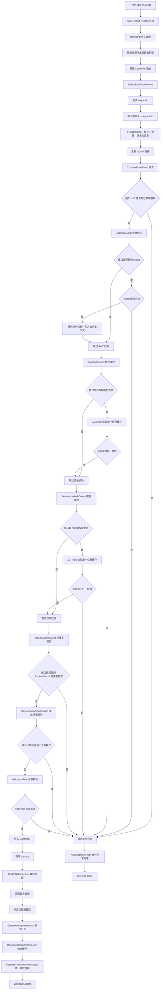

## 二、后端启动与全局能力注册

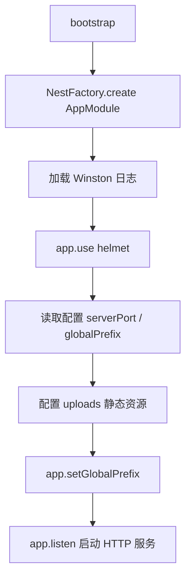

关键文件：

- `apps/server/src/main.ts`：后端启动入口，配置 Helmet、静态资源、全局前缀、端口监听。
- `apps/server/src/app.module.ts`：注册全局 Guard、Pipe、Filter、Interceptor 和中间件。

`AppModule` 中的全局处理顺序大致如下：

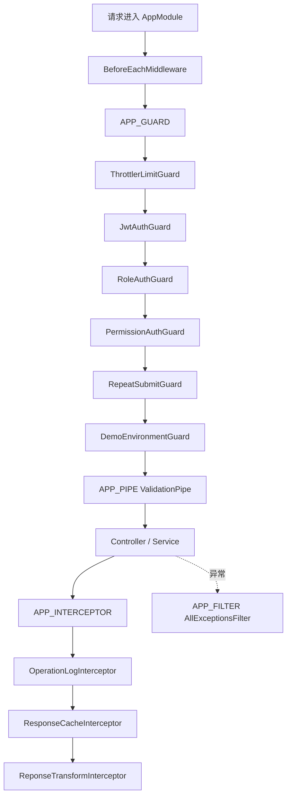

## 三、请求上下文中间件

`BeforeEachMiddleware` 会在请求进入业务逻辑前执行。

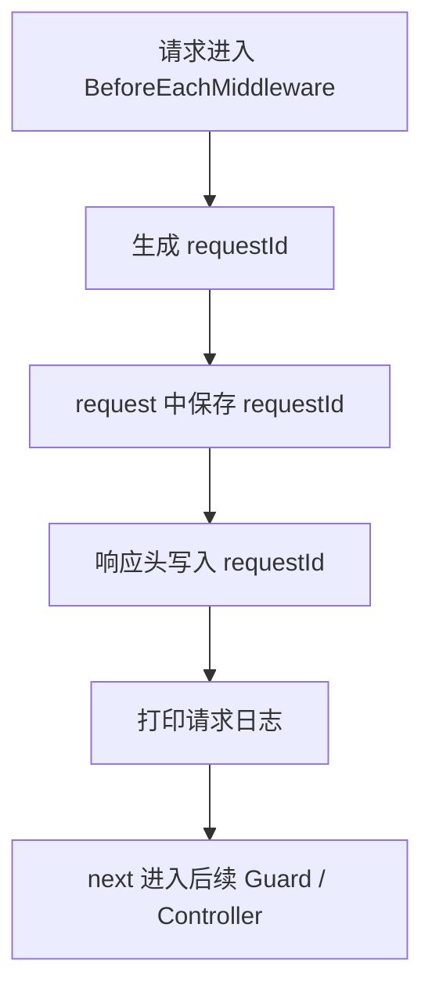

主要职责：

- 生成每个请求唯一的 `requestId`。
- 将 `requestId` 写入请求对象，供后续日志、异常、响应使用。
- 将 `requestId` 写入响应头。
- 打印请求方法、路径、query、body、authorization、user-agent 等信息。

相关文件：

- `apps/server/src/common/middleware/before-each.middleware.ts`

## 四、Guard 权限与安全处理流程

### 1. 限流守卫 ThrottlerLimitGuard

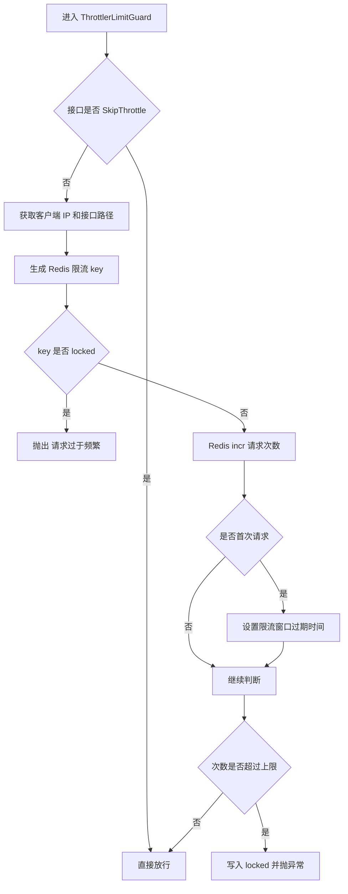

规则：

- 默认 10 秒内最多 10 次。
- 超过限制后锁定 30 分钟。
- 使用接口路径 + IP 作为限流维度。

相关文件：

- `apps/server/src/common/guard/throttler-limit.guard.ts`

### 2. JWT 登录认证 JwtAuthGuard

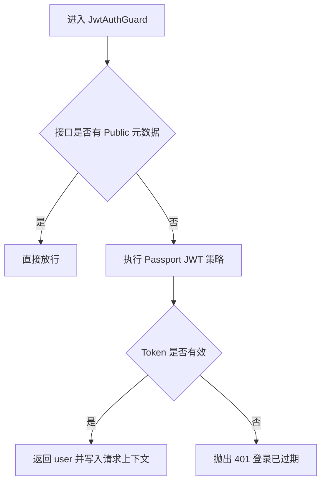

规则：

- 使用 `@Public()` 标记的接口跳过 JWT 校验。
- 非公开接口必须携带有效 Token。
- Token 无效或缺失时抛出 `登录已过期，请重新登录`。

常见公开接口：

- `GET /captcha`
- `POST /login`
- `POST /logout`

相关文件：

- `apps/server/src/common/guard/jwt-auth.guard.ts`
- `apps/server/src/modules/auth/strategies/jwt.strategy.ts`
- `apps/server/src/common/decorator/public.decorator.ts`

### 3. 角色守卫 RoleAuthGuard

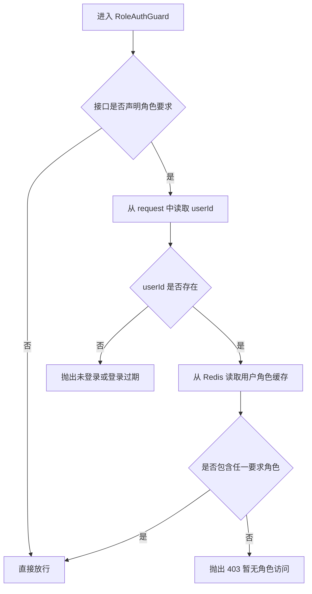

规则：

- 只有接口声明角色元数据时才校验。
- 从 Redis 读取 `ADMIN_USER_ROLES:userId`。
- 只要用户拥有要求角色中的任意一个，就允许访问。

相关文件：

- `apps/server/src/common/guard/role-auth.guard.ts`
- `apps/server/src/common/decorator/require-roles.decorator.ts`

### 4. 权限守卫 PermissionAuthGuard

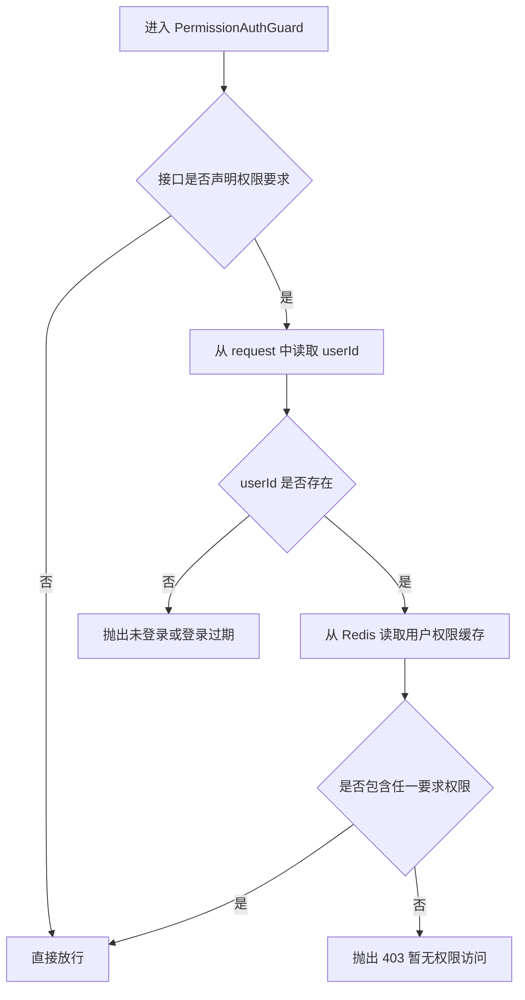

规则：

- 只有接口声明权限元数据时才校验。
- 从 Redis 读取 `ADMIN_USER_PERMISSIONS:userId`。
- 只要用户拥有要求权限中的任意一个，就允许访问。

相关文件：

- `apps/server/src/common/guard/permission-auth.guard.ts`
- `apps/server/src/common/decorator/require-permissions.decorator.ts`

### 5. 防重复提交 RepeatSubmitGuard

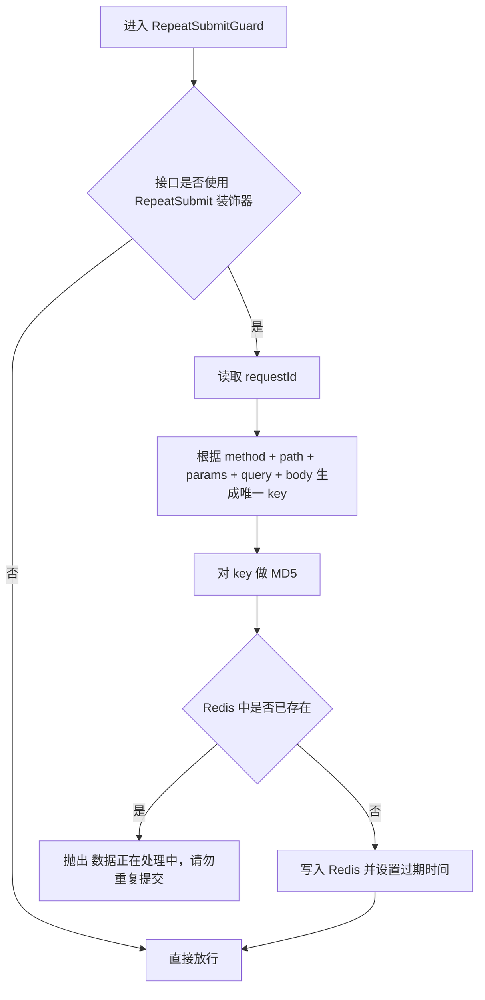

规则：

- 只有使用 `@RepeatSubmit()` 的接口才启用。
- 默认过期时间 5 秒。
- 基于请求方法、路径、params、query、body 生成唯一标识。

相关文件：

- `apps/server/src/common/guard/repeat-submit.guard.ts`
- `apps/server/src/common/decorator/repeat-submit.decorator.ts`

### 6. 演示环境守卫 DemoEnvironmentGuard

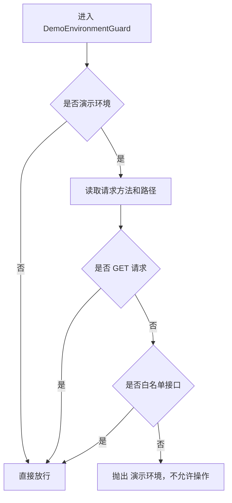

规则：

- 非演示环境全部放行。
- 演示环境允许 GET 请求。
- 演示环境允许白名单中的非 GET 请求，例如登录、退出。
- 其他写操作全部拦截。

相关文件：

- `apps/server/src/common/guard/demo-environment.guard.ts`

## 五、参数验证流程

后端通过全局 `ValidationPipe` 统一处理 DTO 参数校验。

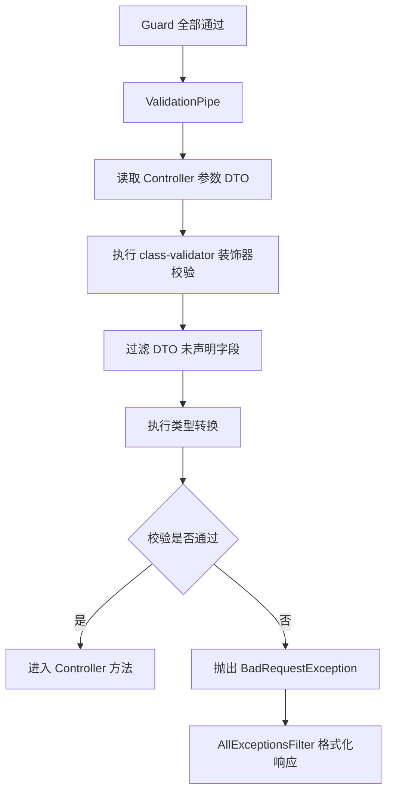

全局配置：

```ts
new ValidationPipe({
  whitelist: true,
  transform: true,
  stopAtFirstError: true,
})
```

配置含义：

- `whitelist: true`：过滤 DTO 中未声明的字段。
- `transform: true`：按 DTO 类型转换参数。
- `stopAtFirstError: true`：遇到第一个错误即停止。

常见 DTO 校验装饰器：

- `@IsNotEmpty()`：不能为空。
- `@IsOptional()`：可选。
- `@IsArray()`：必须是数组。
- `@Matches()`：必须匹配正则。

相关文件：

- `apps/server/src/app.module.ts`
- `apps/server/src/modules/**/*.dto.ts`

## 六、Controller 与 Service 业务处理

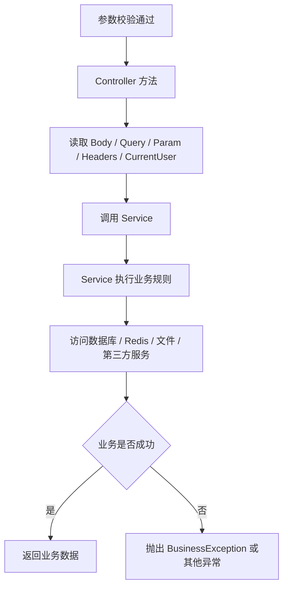

职责划分：

- Controller：接收请求参数，调用 Service，不承载复杂业务逻辑。
- Service：执行业务规则、数据库访问、Redis 访问、文件处理等。
- Entity / DTO：描述数据结构和参数规则。

## 七、响应拦截器流程

### 1. 操作日志 OperationLogInterceptor

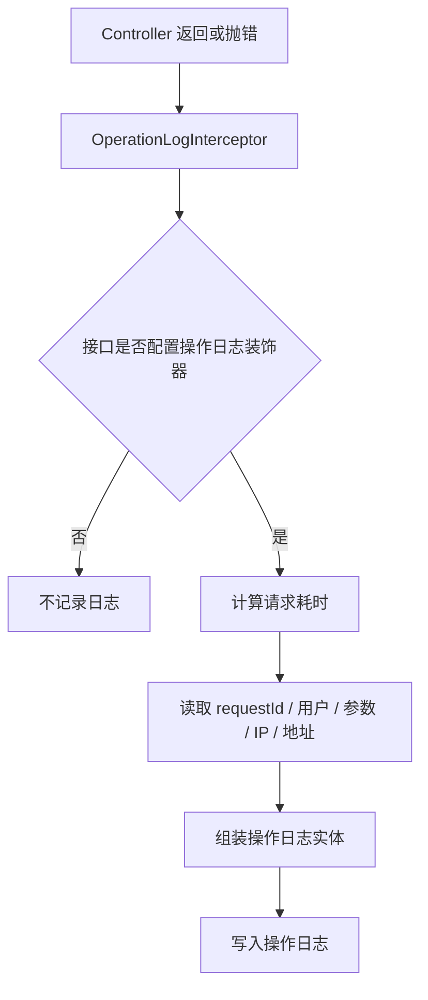

相关文件：

- `apps/server/src/common/interceptor/operation-log.interceptor.ts`
- `apps/server/src/common/decorator/oper-log.decorator.ts`

### 2. 响应缓存 ResponseCacheInterceptor

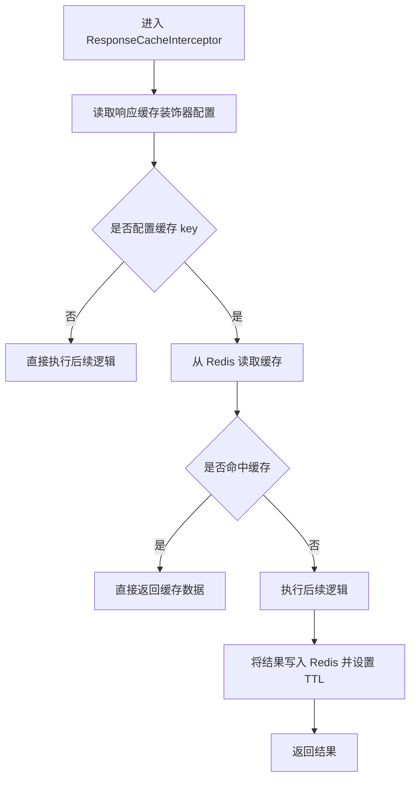

相关文件：

- `apps/server/src/common/interceptor/response-cache.interceptor.ts`
- `apps/server/src/common/decorator/response-cache.decorator.ts`

### 3. 统一响应包装 ReponseTransformInterceptor

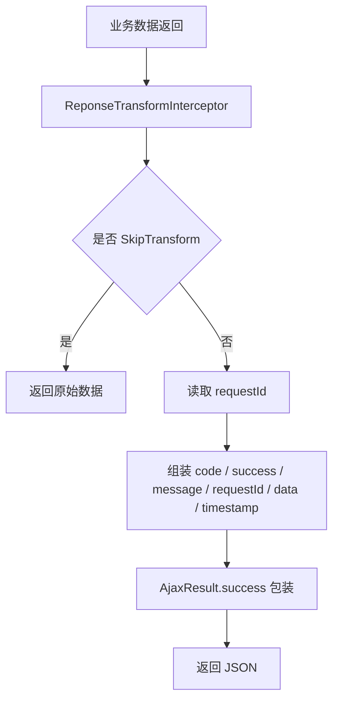

成功响应格式大致为：

```json
{
  "code": 200,
  "success": true,
  "message": "请求成功",
  "requestId": "请求 ID",
  "data": {},
  "timestamp": 1780000000000
}
```

相关文件：

- `apps/server/src/common/interceptor/reponse-transform.interceptor.ts`
- `apps/server/src/common/decorator/skip-transform.decorator.ts`
- `apps/server/src/common/class/ajax-result.class.ts`

## 八、异常处理流程

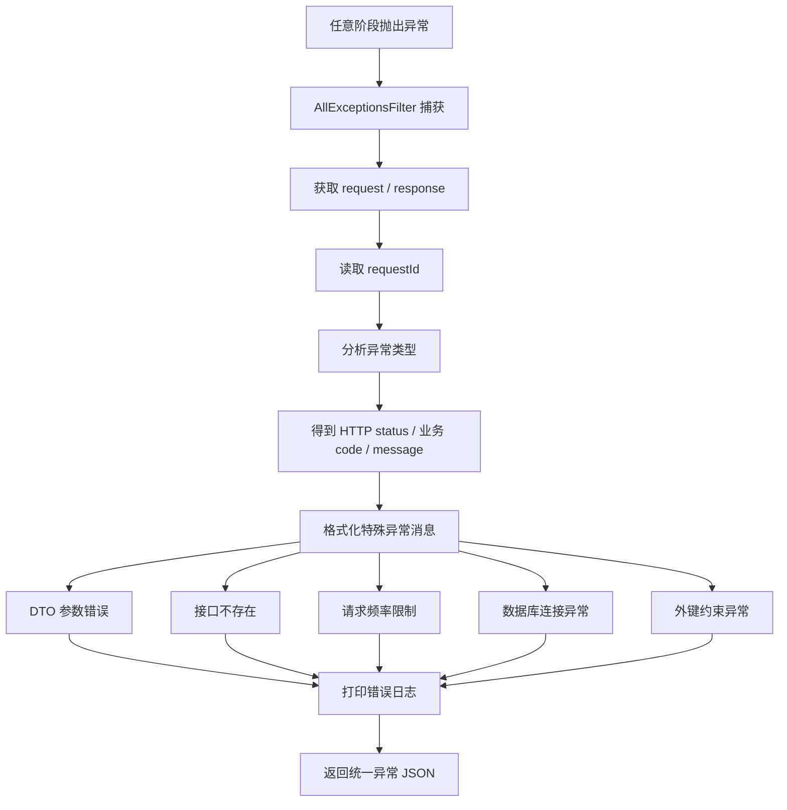

异常响应格式大致为：

```json
{
  "code": 400,
  "success": false,
  "message": "错误信息",
  "requestId": "请求 ID",
  "data": null,
  "timestamp": 1780000000000
}
```

相关文件：

- `apps/server/src/common/filter/all-exception.filter.ts`
- `apps/server/src/common/exception/business.exception.ts`

## 九、登录请求示例

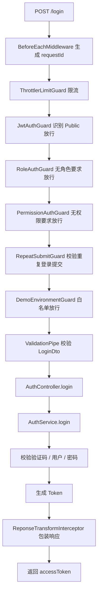

## 十、普通业务请求示例

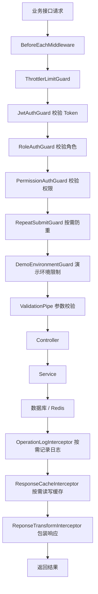

## 十一、关键文件对照表

| 阶段 | 处理内容 | 位置 |
| --- | --- | --- |
| 后端入口 | NestJS 启动、Helmet、全局前缀 | `apps/server/src/main.ts` |
| 全局注册 | Guard、Pipe、Filter、Interceptor、中间件 | `apps/server/src/app.module.ts` |
| 请求上下文 | requestId、响应头、请求日志 | `apps/server/src/common/middleware/before-each.middleware.ts` |
| 限流 | 接口 + IP 维度限流 | `apps/server/src/common/guard/throttler-limit.guard.ts` |
| 登录认证 | JWT 校验，Public 接口跳过 | `apps/server/src/common/guard/jwt-auth.guard.ts` |
| JWT 策略 | Token 解析与用户载荷验证 | `apps/server/src/modules/auth/strategies/jwt.strategy.ts` |
| 角色校验 | Redis 用户角色缓存匹配 | `apps/server/src/common/guard/role-auth.guard.ts` |
| 权限校验 | Redis 用户权限缓存匹配 | `apps/server/src/common/guard/permission-auth.guard.ts` |
| 后端防重 | `@RepeatSubmit()` 接口防重复提交 | `apps/server/src/common/guard/repeat-submit.guard.ts` |
| 演示环境 | 演示环境禁止非白名单写操作 | `apps/server/src/common/guard/demo-environment.guard.ts` |
| 参数验证 | DTO + `ValidationPipe` | `apps/server/src/app.module.ts`、`apps/server/src/modules/**/*.dto.ts` |
| 异常处理 | 统一异常响应 | `apps/server/src/common/filter/all-exception.filter.ts` |
| 操作日志 | 按装饰器记录接口操作日志 | `apps/server/src/common/interceptor/operation-log.interceptor.ts` |
| 响应缓存 | 命中缓存直接返回，未命中写入 Redis | `apps/server/src/common/interceptor/response-cache.interceptor.ts` |
| 响应包装 | 成功响应统一包装 | `apps/server/src/common/interceptor/reponse-transform.interceptor.ts` |
| 业务入口 | Controller 接收请求 | `apps/server/src/modules/**/*.controller.ts` |
| 业务逻辑 | Service 执行业务 | `apps/server/src/modules/**/*.service.ts` |
